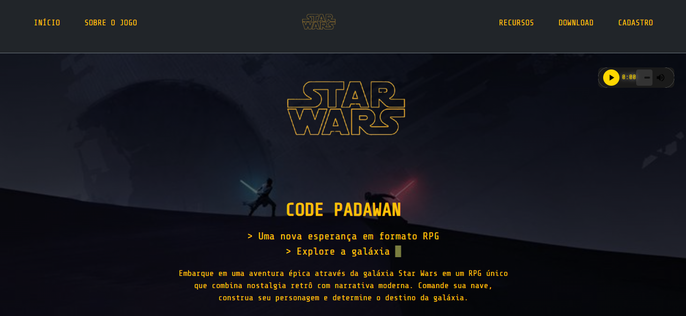
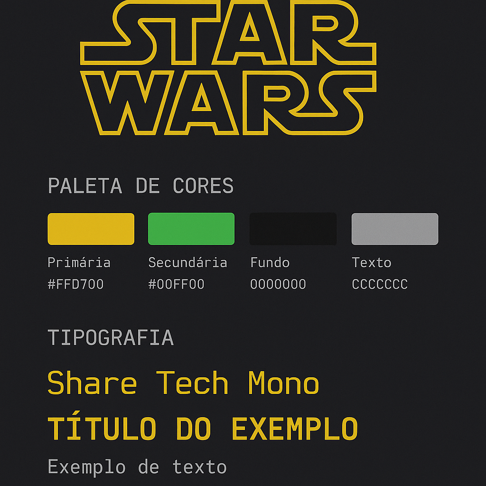

# ⭐ Star Wars: Code Padawan

*Uma nova esperança em formato de site para um RPG fictício de terminal.*


<br>



<br>

## 🚀 Demonstração ao Vivo

Acesse a versão final do projeto hospedada na Vercel:

**[Link do Projeto](https://code-padawans.vercel.app/)**

<br>

## 📜 Índice

* [Descrição do Projeto](#-descrição-do-projeto)
* [Funcionalidades](#-funcionalidades)
* [Tecnologias Utilizadas](#-tecnologias-utilizadas)
* [Identidade Visual](#-identidade-visual)
* [Como Executar Localmente](#-como-executar-localmente)
* [Melhorias Futuras](#-melhorias-futuras)
* [Autores](#-autores)
* [Aviso Legal](#-aviso-legal)
* [Licença](#-licença)

<br>

## 📝 Descrição do Projeto

**Star Wars: Code Padawan** é um projeto de front-end desenvolvido pela equipe Code Padawans para o módulo de HTML/CSS do programa Vem Ser. O site serve como uma página de apresentação para um RPG fictício ambientado no universo Star Wars, com uma estética imersiva inspirada em terminais de computador retrô e interfaces de linha de comando. O objetivo foi criar uma experiência visualmente coesa e funcional utilizando apenas **HTML5, CSS3 e Bootstrap 5.3**, sem o uso de JavaScript.

<br>

## ✨ Funcionalidades

- **Tema Imersivo:** Design que simula um terminal de computador, com fontes monoespaçadas, cores neon e animações sutis.
- **Responsividade:** O layout se adapta a diferentes tamanhos de tela, de desktops a dispositivos móveis.
- **Formulário Acessível:** Formulário de cadastro com validação de dados em tempo real e feedback visual, utilizando apenas atributos HTML e pseudo-classes CSS.
- **Interatividade sem JS:** Efeitos de hover, animações de entrada e um cursor piscando para aumentar a imersão, tudo feito com CSS puro.
- **Componentes Temáticos:** Seções bem definidas para apresentar o jogo, seus recursos, plataformas de download e galeria de mídia.
- **Páginas de Feedback:** Inclui página de `sucesso.html`personalizada para um fluxo de usuário completo.

<br>

## 💻 Tecnologias Utilizadas

- **HTML5:** Estrutura semântica para melhor acessibilidade e SEO.
- **CSS3:** Estilização avançada, utilizando Flexbox, Grid Layout, Animações (`@keyframes`) e Variáveis CSS (`custom properties`).
- **Bootstrap 5.3:** Framework utilizado para o sistema de grid, componentes base e responsividade.

<br>

## 🎨 Identidade Visual



O projeto segue um guia de estilo consistente para manter a imersão.

* **Paleta de Cores:**
   | Elemento         | Cor Hex    | Visual |
   |------------------|------------|--------|
   | Cor Primária   | `#FFD700`  | <span style="background-color:#FFD700;color:#000;padding:4px 12px;border-radius:6px;font-family:monospace;">#FFD700</span> |
   | 🧬 Cor Secundária | `#00FF00`  | <span style="background-color:#00FF00;color:#000;padding:4px 12px;border-radius:6px;font-family:monospace;">#00FF00</span> |
   | 🌑 Fundo          | `#000000`  | <span style="background-color:#000000;color:#fff;padding:4px 12px;border-radius:6px;font-family:monospace;">#000000</span> |
   | 📄 Texto          | `#CCCCCC`  | <span style="background-color:#CCCCCC;color:#000;padding:4px 12px;border-radius:6px;font-family:monospace;">#CCCCCC</span> |
   | 🧱 Bordas         | `#333333`  | <span style="background-color:#333333;color:#fff;padding:4px 12px;border-radius:6px;font-family:monospace;">#333333</span> |

* **Tipografia:**
    * **Fonte Principal:** `Share Tech Mono` (importada do Google Fonts).
    * **Fallback:** `Courier New`, `monospace`.

<br>

## 🛠️ Como Executar Localmente

Siga os passos abaixo para executar o projeto em sua máquina:

1.  **Clone o repositório:**
    ```bash
    git clone https://github.com/milenagsoares/ProjetoFinal-HTML-CSS.git
    ```
2.  **Navegue até a pasta do projeto:**
    ```bash
    cd ProjetoFinal-HTML-CSS\PROJETOFINAL\bootstrap-app\src
    ```
3.  **Abra o arquivo principal:**
    * Abra o arquivo `index.html` diretamente no seu navegador de preferência.

<br>

## 🔮 Melhorias Futuras

O projeto foi construído com futuras expansões em mente:

- [ ] Implementar JavaScript para tornar o formulário de cadastro dinâmico (enviando dados via AJAX/Fetch API).
- [ ] Adicionar um modal para exibir o vídeo do YouTube diretamente na página.
- [ ] Otimizar todas as imagens para o formato `.webp` para melhor performance.
- [ ] Refatorar o CSS para utilizar a metodologia BEM (Block, Element, Modifier).

<br>

## 👨‍🚀 Autores

Este projeto foi desenvolvido com a Força e a colaboração de:

* **[Luigi Rodrigo]** 
* **[Milena Gonçalves]** 
* **[Maria Eduarda Timiraos]** 

<br>

## ⚖️ Aviso Legal

**Star Wars Terminal Edition** é um projeto de fã não oficial. Star Wars e todas as suas marcas associadas são marcas registradas da Lucasfilm Ltd. Este projeto não é afiliado, endossado ou patrocinado pela Lucasfilm Ltd. ou pela The Walt Disney Company.

<br>

## 📄 Licença

Este projeto está sob a licença MIT. Veja o arquivo [LICENSE](LICENSE) para mais detalhes.